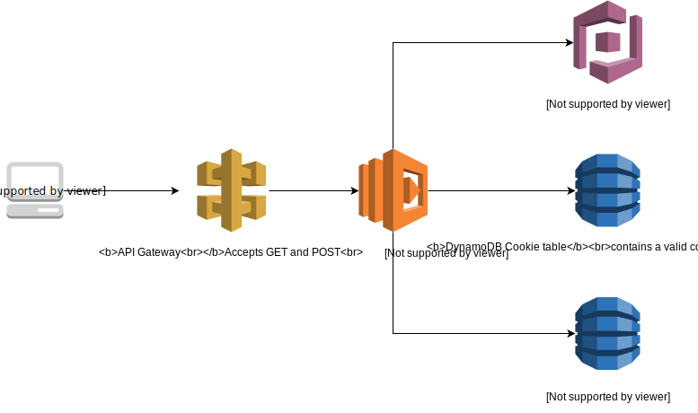

serverless-cognito
==================
Authenticate your users through Cognito, Lambda, API Gateway and DynamoDB. The script will set a local cookie in the browser and prompt for reauthentication by the user if needed. A simple web UI is provided which allows users to register, login, logout, see their profile and see all users.

The cookies are stored in a DynamoDB table that is part of the deployment. All user accounts are safely stored using a Cognito user pool. The Lambda function handles authentication, authorization and renders the HTML output. A second DynamoDB table is used to store the weblogs from user visits. 

You can easily deploy the solution using the [Serverless Application Repository](https://serverlessrepo.aws.amazon.com/applications/arn:aws:serverlessrepo:us-east-1:517266833056:applications~serverless-cognito).

Installation
------------

There are two ways to install;

1. You can  use the [Serverless Application Repository](https://serverlessrepo.aws.amazon.com/applications/arn:aws:serverlessrepo:us-east-1:517266833056:applications~serverless-cognito) to easily deploy the application in 2 minutes. Check the 'resources' tab under CloudFormation to find the login URL of your application.

2. Edit 'build.sh' with your preferred region, s3 bucket and stack name to deploy manually. After running the bash script, the Lambda artifact will be uploaded to your bucket and used for the CloudFormation deploy. As a final step, you will see the URL you can use to access the application. After deployment, the CloudWatch logs will be tailed if 'saw' is installed. 

Once you want to remove the service, simply delete the CloudFormation stack in your AWS account. 

Roadmap (open to new suggestions)
---------------------------------

- [ ] Add change password functionality for users.
- [ ] Add email or SMS validation for new accounts. 
- [ ] Handle authentication using a custom authorizer in API Gateway. 
- [ ] Add diagnostic pages (amount of users, last logins, etc.)
- [X] Add a fully functional profile with some user data.
- [X] Increase cookie security (better random generation and secure storage in browser).
- [X] Set TTL of 3 days for cookies set in browser.
- [X] Add fully functional login/logout. 

Contact
-------

In case of questions or bugs, please raise an issue or reach out to @marekq!
